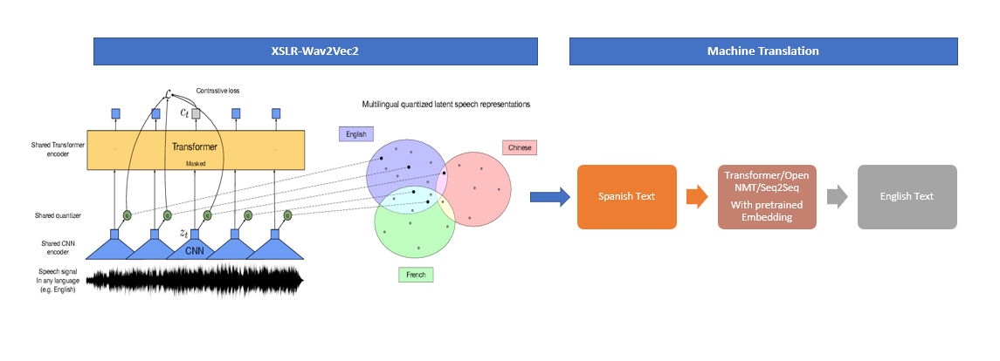
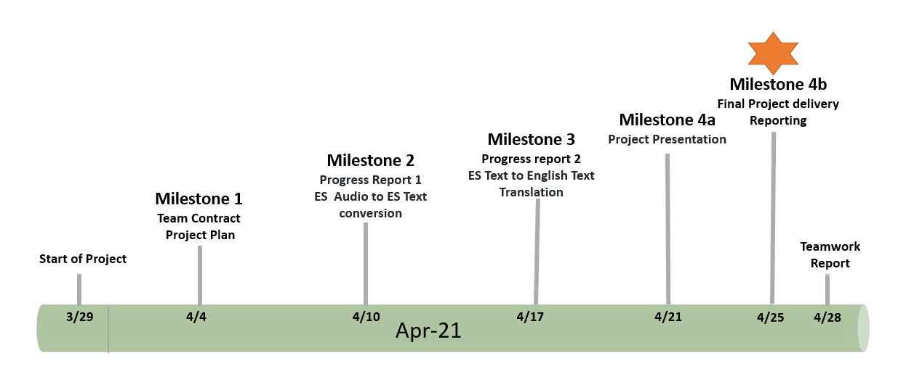

### Project Proposal

##### Introduction
 - This project will use `Automatic Speech Recognition(ASR)` with Wav2Vec2 on Spanish Audio and convert it to English text. 
 - Our plan is to utilize a fine tuned XLSR-Wav2Vec2 Multilingual model using `Huggingface Transformer`, input the Spanish audio dataset from `openslr.org` or `commonvoice.mozilla.org`. The overall model architecture will be pipeline based, where audio input will first be converted into Spanish text using XLSR-Wav2Vec2. Then we will use this text output from XLSR as an input for an MT model, which will translate the Spanish text to English text-based translation.

##### Motivation
- It's a very intriguing, and exciting project to work on, moreover, it is a great opportunity for us to learn new models which fall into the speech data processing category (example: XLSR- released in September 2020), and combine these new tools with what we have learned in the previous block (NMT , FastText etc). We aim to create a new model which is relatively new in terms of work done in the industry.
- We want to design this project in State of the art fashion and create an End to End model for audio to language translation. This model can be further extended to translate audio from one language to text of different language which will help others to explore this domain.
- By working on this project, we will learn newly introduced models and technology which will help us to understand these concepts in detail.

##### Data
We will be using multilingual corpus of ‘TEDx talks for speech recognition and translation’ from http://openslr.org/100/.  Statistics about the data is as below:

|Data|Size Information|
|---|---|
| Spanish speech and transcripts data size  | 35GB |
| Spanish speech and transcripts with aligned English translations  |  13GB |
| Talks  | 1031   |
| Sampling Rate  | 48KHZ   |
|  Total hours of audio | ~216  |
|  Gogle Drive space | 100GB  |
|  Google Colab Pro space | 190GB  |

    
| Set | Talks | Sentences | Words src | Time |
| :-----: | :-: | :-: | :-: | :-: |
| Train | 988 | 102171 | 1676862 | 212h18m21s |
| Valid | 12 | 905 | 14327 | 1h56m53s |
| Test | 301 | 1012 | 15439 | 2h4m35s |

Update from Week 2:

The team members have tried to train the speech recognition model on the Spanish speech data on Goolge Colab Pro with additional Google Drive space. However, even with additional disk space from the premium tier, the Spanish speech data seems to be too large to be trained on Google Colab. Therefore, the team is considering using smaller datasets on languages such as Estonian, Czech, Portuguese, or Basque. The team has also switched the data source from Open SLR to Mozilla Common Voice because Mozilla Common Voice dataset has more samples and sample diversity. After testing training Estonian, Czech, Portuguese, and Basque dataset on Google Collab, the team finds that Estonian dataset and Portuguese datasets are small enough to be trained within Google Collab. Therefore, the team will focus on Estonian audio or Portuguese audio to English text translation task.

##### Engineering
Group-6 will use Google Colab Pro for training the model, and PyTorch as the framework. The codebase will be based on "Fine-tuning XLSR-Wav2Vec2 for Multi-Lingual ASR with Huggingface Transformers" by Patrick von Platen, which is avaliable at (https://colab.research.google.com/github/patrickvonplaten/notebooks/blob/master/Fine_Tune_XLSR_Wav2Vec2_on_Turkish_ASR_with_%F0%9F%A4%97_Transformers.ipynb)

The project's input is Spanish audio, and the output is English text. Therefore, the project can be broken into two parts: the upstream task of converting Spanish audio into vector representation and the downstream task of converting that Spanish vector representation into English text.

For the audio conversion part of the project, the team plan to use XLSR-Wav2Vec2 model, which is a transformers model that comes with the transformers package. For the vector to text part of the project, the team plan to try a any  of LSTM, transformer and seq2seq models with pretrained embeddings like FastText.

Update from week 2:

The team members have trained XLSR-Wav2Vec2 models using Estonian and Portuguese data from Mozilla Common Voice. Those two langauges have a small enough training dataset to be trained within Google Collab. The team have also identified a list of resources for pre-trained word embeddings for those two languages, which would be helpful in building the translation task. The team is making good progress and constanly sharing results in the slack channel.

##### Previous Works

One of our team member has extensive knowledge on working on audio codecs.  He has worked on project of converting audio to multiple formats using different sampling frequency. This will help us in understanding various nuisances related to audio quality and conversion.

Additionally, all team members have worked on machine translation project last block.  One of team members MT project was selected as top scorer in last block.

##### Evaluation
We will evaluate out system on two main metrics. One is WER(Word error rate) for audio conversion and other is BLEU score for Spanish to English text conversion.

Update from week 2:
The team trained XLSR-Wav2Vec2 models on Estonian and Portuguese and tested the WER. The WER for Estonian is 0.43 and the WER for Portuguese is better at 

##### Conclusion
- We will deliver an End to End working model which will fulfill the objective of the project and completed on time, with the quality as per defined in the different milestones

##### Project Milestones

Project milestone is based on current plan as of today, there may be change in some of deliverables based on the complexity or if there is any change in plan.

