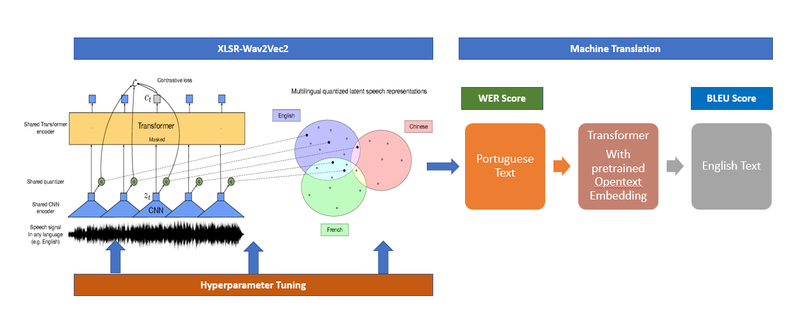

### Project Proposal

##### Introduction
 - In this project, we are using `Automatic Speech Recognition (ASR)` with Wav2Vec2 on Portuguese Audio and convert it to English text.
 - We have fine-tuned XLSR-Wav2Vec2 Multilingual model using `Huggingface Transformer`, with Portuguese audio dataset from `commonvoice.mozilla.org`. The overall model architecture is pipeline-based, where audio input is first converted into Portuguese text using XLSR-Wav2Vec2. Then we used this text output from XLSR as an input for an MT model, which translated the Portuguese text to English text-based translation.

##### Motivation

- It's a very intriguing, and exciting project to work on, moreover, it is a great opportunity for us to learn new models which fall into the speech data processing category (example: XLSR- released in September 2020), and combine these new tools with what we have learned in the previous block (NMT , FastText etc). We aim to create a new model which is relatively new in terms of work done in the industry.
- We want to design this project in State of the art fashion and create a pipeline model for audio to language translation. This model can be further extended to translate the audio from one language to text of a different language which will help others to explore this domain.
- By working on this project, we will learn newly introduced models and technology which will help us to understand these concepts in detail.
- Speech translation has many applications that include travel assistants(two-way translation system on a mobile device), movie dubbing/subtitling, language documentation, and crisis response, Simultaneous translation for lecture translation application. These applications can benefit all the people even though they are speaking different languages. These applications will help in overcoming language barriers, growing businesses and better interaction between different language speaking people.(Ref: Sperber, M., & Paulik, M. (2020). Speech translation and the end-to-end promise: Taking stock of where we are. arXiv preprint arXiv:2004.06358.)
 
 All the aforementioned benefits intrigued us to choose this Speech Translation project.

##### Data

We have used Portuguese audio data from `commonvoice.mozilla.org`. whereas for PT-EN aligned text we have used aligned transcripts from a multilingual corpus of ‘TEDx talks for speech recognition and translation’ from http://openslr.org/100/. Statistics about the data is as below:

|Google|Size Information|
|---|---|
| Gogle Drive space | 100GB |
| Google Colab Pro space | 190GB |

|Data|Size Information|
|---|---|

|Data|Size Information|
|---|---|
| Portuguese speech and transcripts data size | 2 GB |
| Talks | 1120 |
| Audio Format | mp3 |
| Sampling Rate | 48KHZ |
| Total hours of audio | ~63 |
| Validated hours of audio | ~50 |

| Set | Talks | Time |
| :-----: | :-: | :-: |
| Train | 896 | ~51 hrs |
| Valid | 112 | ~6 hrs |
| Test | 112 | ~6 hrs |

Portuguese speech and transcripts with aligned English translations
mtedx_pt-en.tgz – 10GB

##### Challenges

###### Drive & Colab Space and training time

- After extensive testing on the multiple audio datasets, the team finds out that Google Colab cannot handle the size of the audio training dataset with more than 1GB due to space constraints on Google Colab Pro(200 GB) and Google Drive (100GB).  
- Each model is taking ~15-20 hours to train which is very time-consuming.
- Most of the time team ran out of Google Colab GPU quota and the model stopped unexpectedly.

##### Engineering

Group-6 is using Google Colab Pro for training the model, and PyTorch as the framework. The codebase is based on "Fine-tuning XLSR-Wav2Vec2 for Multi-Lingual ASR with Huggingface Transformers" by Patrick von Platen, which is available at (https://colab.research.google.com/github/patrickvonplaten/notebooks/blob/master/Fine_Tune_XLSR_Wav2Vec2_on_Turkish_ASR_with_%F0%9F%A4%97_Transformers.ipynb)

The project's input is Portuguese audio, and the output is the English text. Therefore, the project is broken into two parts: the upstream task of converting Portuguese audio into vector representation and the downstream task of converting that Portuguese vector representation into English text.

For the audio conversion part of the project, the team is using the XLSR-Wav2Vec2 model. For the vector to text part of the project, the team used a transformer model with pre-trained FastText embeddings (https://fasttext.cc/docs/en/crawl-vectors.html).

**Audio Quality:** We have listened to the audio quality of few files and there were not any noise issues.

**Language model:** We will not be using any language model in our pipeline to enhance our model's performance due to time constraints.

**Pre-processing of Transcriptions:** We cleaned the data using the regex during the pre-processing stage.

**Base-line model:** We have used the same initial hyperparameters from the wav2vec2 template to baseline the model and then we fine-tuned the hyperparameters to get the target WER range.(Check the Hyperparameters section for the original and fine-tuned hyperparameter section.

**Downsampling:** We used the Librosa library to downsample the data to 16KHZ

**Spellcheck Model:** We have not utilized the spellcheck model before feeding PT data to the MT model because of time constraints. We have got a better BLEU score without it and we have decided to finetune ASR model instead of adding additional models to enhance performance.

**Parallel Data for Portuguese:** We have decided to choose Portuguese as there was parallel data available for an MT model. We got this from ‘TEDx talks for speech recognition and translation’ from http://openslr.org/100/

**Hyperparameter Tuning**

**Iteration 1 – WER score – 0.30**
        

    training_args = TrainingArguments(
          output_dir="/content/gdrive/MyDrive/wav2vec2-large-xlsr-portuguese-demo",  
          group_by_length=True,
          per_device_train_batch_size=16,
          gradient_accumulation_steps=2,
          evaluation_strategy="steps",
          num_train_epochs=25,
          fp16=True,
          save_steps=800,
          eval_steps=400,
          logging_steps=400,
          learning_rate=3e-4,
          warmup_steps=500,
          save_total_limit=2,
        )
        
    model = Wav2Vec2ForCTC.from_pretrained(
        "facebook/wav2vec2-large-xlsr-53", 
        attention_dropout=0.1,
        hidden_dropout=0.1,
        feat_proj_dropout=0.0,
        mask_time_prob=0.05,
        layerdrop=0.1,
        gradient_checkpointing=True, 
        ctc_loss_reduction="mean", 
        pad_token_id=processor.tokenizer.pad_token_id,
        vocab_size=len(processor.tokenizer)
    )

**Iteration 2 : WER score – 0.2860 - BLEU = 58.39**

    **ASR WAV2VEC2**
    
    model = Wav2Vec2ForCTC.from_pretrained(
    "facebook/wav2vec2-large-xlsr-53", 
    attention_dropout=0.1,
    hidden_dropout=0.1,
    feat_proj_dropout=0.0,
    mask_time_prob=0.05,
    layerdrop=0.1,
    gradient_checkpointing=True, 
    ctc_loss_reduction="mean", 
    pad_token_id=processor.tokenizer.pad_token_id,
    vocab_size=len(processor.tokenizer)
     )
     
     training_args = TrainingArguments(
       output_dir="/content/gdrive/MyDrive/COLX585/wav2vec2_pt",       
       group_by_length=True,
       per_device_train_batch_size=16,
       gradient_accumulation_steps=2,
       evaluation_strategy="steps",
       num_train_epochs=30,
       fp16=True,
       save_steps=800,
       eval_steps=400,
       logging_steps=400,
       learning_rate=3e-4,
       warmup_steps=500,
       save_total_limit=2,
       
    **Transformer Model with FastText**
    
    save_checkpoint_steps: 500  #10000
    keep_checkpoint: 10
    seed: 3435
    train_steps: 10000  #200000  # 500000
    valid_steps:  500  #10000
    warmup_steps:  1200 #400 #8000
    report_every: 100
    early_stopping: 4  #8
    # Model architecture
    decoder_type: transformer
    encoder_type: transformer
    word_vec_size: 512 # 300 causes error
    rnn_size: 512
    layers: 6
    transformer_ff: 2048
    heads: 8
    accum_count: 8  #4 <---
    #accum_steps: [0]
    #model_dtype: "fp32"
    optim: adam
    adam_beta1: 0.9   # not in Google's best model
    adam_beta2: 0.998
    decay_method: noam
    learning_rate: 2.0  # 1.0 was suboptimal
    max_grad_norm: 0.0
    batch_size: 1024  #4096  #2048  #4096
    valid_batch_size: 1024  #2048  #4096
    batch_type: tokens
    normalization: tokens
    dropout: 0.2  #0.1
    attention_dropout: 0.1
    label_smoothing: 0.1
    #queue_size: 10000  #
    #backet_size: 32768  #
    max_generator_batches: 2
    param_init: 0.0
    param_init_glorot: 'true'
    position_encoding: 'true'
    world_size: 1
    gpu_ranks:
    - 0

##### Previous Works

One of our team members has extensive knowledge of working on audio codecs. He has worked on the project of converting audio to multiple formats using different sampling frequencies. This will help us in understanding various nuisances related to audio quality and conversion.

Additionally, all team members have worked on a machine translation project last block. One of the team members MT project was selected as the top scorer in last block.

##### Evaluation
We evaluated our system on two main metrics. One is WER(Word error rate) for audio conversion and the other is BLEU score for Portuguese to English text conversion.
- The team trained XLSR-Wav2Vec2 models on Portuguese and tested the WER. The WER for Portuguese is better at 0.286000.
We have got a BLEU score of 9.05 on pre-trained embedding
- We are reporting WER on the ASR model, BLEU on MT, and then BLEU on the entire pipeline.
- Our final iteration WER score is 0.2860 and BLEU score is 58.39

##### Conclusion
- Our model is a working model which we have ran multiple times and is meeting with the quality as defined in the different milestones.

##### Project Milestones

Project milestone is based on the current plan as of today, there may be a change in some of the deliverables based on the complexity or if there is any change in plan.
We are making progress as per milestones defined with minor updates.

